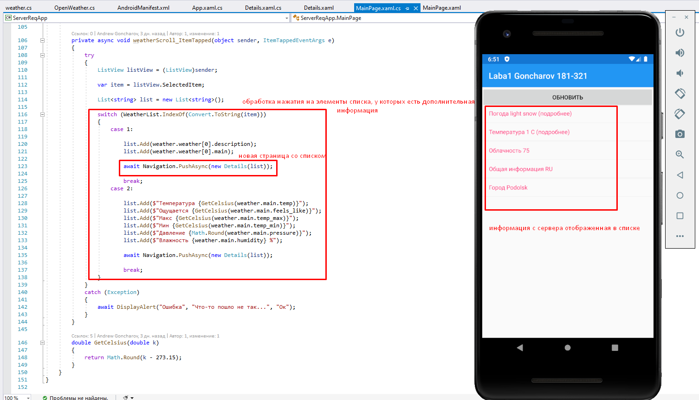
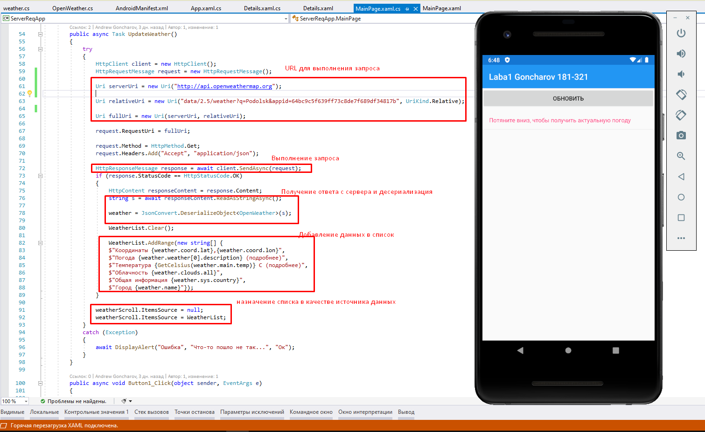
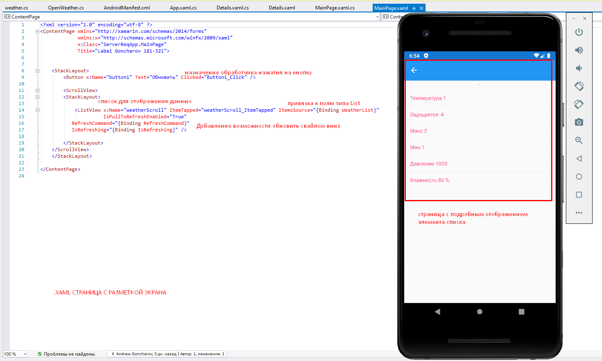
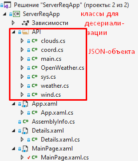

# Weahter application (OpenWeather API) made with Xamarin.Forms
## Гончаров Андрей, 181-321 (Goncharov Andrew)
### Лаба 1 "Список и детали"

This web app uses some nice techs and langs like:

<ul>
    <li>Xamarin.Forms</li>
    <li>C#</li>
</ul>

To launch it just download and open .sln with VS. You need android emulator, SDK and NDK also. You can set their paths in VS settings in "Xamarin".

